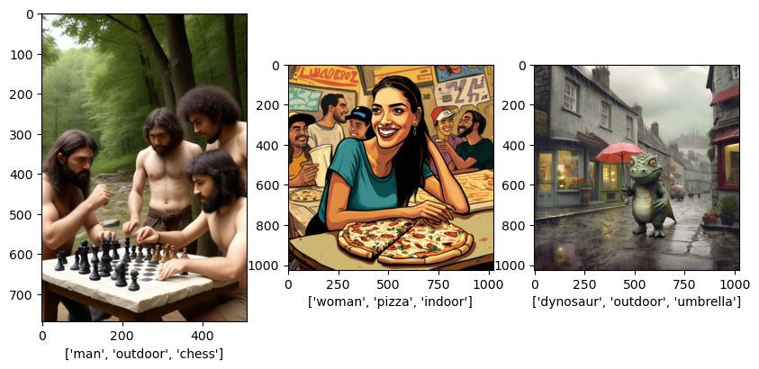
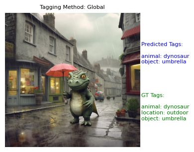
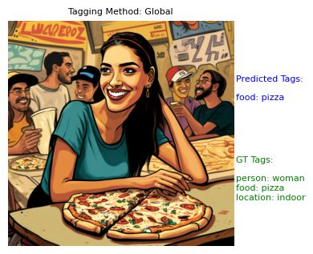

# ClipTagger
There are two tagging algorithms implemented: 
1. "Global tagger" - a simpler algorithm as a baseline
2. "Local tagger" - a more sophisticated algorithm for better results.

Unfortunately, I ended up implementing each in a separate class, which is not very optimal since they should have been either two methods in the same class or two classes inheriting from a base class. 

In order to evaluate the taggers I first created a small database with ground-truth tags. It consists of 78 images which I manually tagged using the following tag dictionary:

```python
Tags Dictionary:
{'animal': ['cat', 'dog', 'dynosaur', 'tiger', 'bear', 'horse'],
 'transport': ['car', 'ship'],
 'scifi': ['dalek', 'tardis', 'robot'],
 'person': ['man', 'woman', 'child'],
 'location': ['indoor', 'outdoor'],
 'food': ['pizza', 'pancake', 'tea', 'cheese', 'oil'],
 'country': ['rome', 'india', 'israel'],
 'games': ['chess', 'baseball'],
 'object': ['umbrella', 'camera', 'clock', 'papers', 'book']}
```

Here are a few examples of images from the dataset and their tags:



All in all there are 185 tag assignments, that is 2.37 tags on average per image. I will be using [the sklearn classification report](https://scikit-learn.org/stable/modules/generated/sklearn.metrics.classification_report.html) for evaluation, focusing on the Weighted F1 and Sample F1 metrics.

# Getting started

First of all, install the packages listed in the requirements file.

Now load the dataset and the tag dictionary.

```python
import pprint
from utils import load_tag_dictionary_from_text_file, load_images_and_filenames, evaluate_tagger_on_dataset

from tagger import CLIPTagger
from tagger_global import CLIPTagger as OldTagger

tag_dictionary = load_tag_dictionary_from_text_file('tags_ims/tagdict.txt')
pprint.pp(tag_dictionary)

# If you want to work with my dataset, otherwise use your own
gt_dict = load_tag_dictionary_from_text_file('tags_ims/gt.txt')
images, filenames = load_images_and_filenames('tags_ims')
```

# "Global" Tagger - the simple one

This was meant to be a trivial throwaway baseline method but it ended up performing suprisingly well on the dataset so I kept it around. 

The idea is simple: concatenate all the labels into one large list (hence the name "global") and use them as text strings to embed by CLIP. Then each image embedding is compared to them, the raw logits are normalized by softmax and all those labels passing a fixed threshold, e.g. 0.2, are returned. This allows for the presence of labels from the same class and also to not tag at all an attribute that is not present, since in the latter case all the attribute's labels will receive low scores. In case an image is completey unrelated to the given labels, all bets are off. 

```python
tagger_0 = OldTagger(tag_dictionary)
tagger_0.set_global_logit_prob_th(0.1)
```

Let's run in on a few images from the dataset and display the results.

```python
from utils import display_image_with_tags, create_gt_dict_for_file

k = 5
res_k = tagger_0(images[k])
gt_for_image_k = create_gt_dict_for_file(filenames[k], gt_dict, tag_dictionary)
display_image_with_tags(images[k], res_k, gt_for_image_k, tagging_method="Global") 
```


```python
k = 12
res_k = tagger_0(images[k])
gt_for_image_k = create_gt_dict_for_file(filenames[k], gt_dict, tag_dictionary)
display_image_with_tags(images[k], res_k, gt_for_image_k, tagging_method="Global") 
```


Now let's run the tagger on all the dataset and produce a report:
```python
from utils import evaluate_tagger_on_dataset

f0, report0 = evaluate_tagger_on_dataset(tagger_0, tag_dictionary, gt_dict, images, filenames)
print(f0)
```
```markdown
0.5113272419154772
```
This means that the Weighted F1 score of the global tagger is 51.1% (I chose weiighted because there is quite a bit of class imbalance in the dataset). Now let's see the full report as well:

```python
pprint.pp(report0)
```
```markdown
('              precision    recall  f1-score   support\n'
 '\n'
 '         cat       0.90      0.90      0.90        10\n'
 '         dog       1.00      1.00      1.00         2\n'
 '    dynosaur       0.67      1.00      0.80         2\n'
 '       tiger       0.50      1.00      0.67         3\n'
 '        bear       1.00      1.00      1.00         3\n'
 '       horse       1.00      1.00      1.00         5\n'
 '         car       1.00      0.40      0.57         5\n'
 '        ship       0.75      1.00      0.86         3\n'
 '       dalek       0.71      1.00      0.83         5\n'
 '      tardis       0.75      1.00      0.86         3\n'
 '       robot       0.75      1.00      0.86         6\n'
 '         man       1.00      0.06      0.12        16\n'
 '       woman       1.00      0.18      0.30        17\n'
 '       child       0.00      0.00      0.00         2\n'
 '      indoor       1.00      0.33      0.50        21\n'
 '     outdoor       0.75      0.09      0.15        35\n'
 '       pizza       0.50      1.00      0.67         2\n'
 '     pancake       1.00      1.00      1.00         3\n'
 '         tea       1.00      0.25      0.40         4\n'
 '      cheese       1.00      0.67      0.80         3\n'
 '         oil       0.50      1.00      0.67         1\n'
 '        rome       0.62      0.83      0.71         6\n'
 '       india       0.50      1.00      0.67         1\n'
 '      israel       0.00      0.00      0.00         1\n'
 '       chess       1.00      1.00      1.00         7\n'
 '    baseball       1.00      0.50      0.67         2\n'
 '    umbrella       0.50      0.33      0.40         3\n'
 '      camera       0.25      1.00      0.40         1\n'
 '       clock       1.00      1.00      1.00         1\n'
 '      papers       0.67      1.00      0.80         2\n'
 '        book       0.80      0.40      0.53        10\n'
 '\n'
 '   micro avg       0.77      0.48      0.59       185\n'
 '   macro avg       0.75      0.71      0.65       185\n'
 'weighted avg       0.85      0.48      0.51       185\n'
 ' samples avg       0.86      0.55      0.62       185\n')
```

# "Local" Tagger - the more advanced one
This more advanced method handles more proactively the "irrelevant tag" problem. Also I tried to robustify the algorithm by using a set of templates instead of just one string for each class. The original templates examined were:
```
"This is an image of a {X}.",
"Here we see a {X}.",
"The photo depicts a {X}.",
"In this picture, there is a {X}.",
"This picture shows a {X}.",
"A {X} is present in this image.",
"You can see a {X} here.",
"This image represents a {X}.",
"A {X} is captured in this shot.",
"The object in this image is a {X}."
```
This was supposed to compensate for unknown deformations or problems in CLIP embedding space. In practice the initial results using the full set of templates were very bad! (Using the sklearn report in the way shown above). After some debugging I found out that the best results are obtained by retaining only two of the templates:
```
"This is an image of a {X}.",
"This picture shows a {X}.",
```
I did not have the leisure to get to the bottom of this phenomenon, alas. 

Two more additional tricks were used in this method. First, I also added the _negation_ of each template for each label, Instead of hard-coding negations I used the [*negate* library](https://github.com/dmlls/negate). Second, I added a None-type string for each category (e.g. 'animal'):
```
"There is no {X} in this image."
```

So now for each label (e.g. 'cat' or 'dog') we have 4 different strings (2 positive and 2 negative) and each category has a category-level negative strings. So if the global tagger worked with 31 strings (= the total number of labels), the local tagger works with 133 strings (= 4*31 + 9 category-level strings). Since this is all done at init time and matrix products are cheap for these sizes, the overhead is negligible.

## Formula Explanation

After the logits are computed, for each label we define:

- **L+** as the maximum logit value of its positive templates.
- **L-** as the maximum logit value of its negative templates.
- **G** as the logit value of the corresponding category-level negative template.

We then tag the image with the label if and only if:

**L+ > max(L-, G)**

Additionally, we require that the softmax of the vector **[L+, L-, G]** is above a parameter threshold to ensure confidence in the results.

## Results

Now let us run the full report for the local tagger.

```python
tagger_1 = CLIPTagger(tag_dictionary)
tagger_1.set_local_logit_prob_th(0.4)

f1, report1 = evaluate_tagger_on_dataset(tagger_1, tag_dictionary, gt_dict, images, filenames)
print(f1)
```
```markdown
0.6706632174635662
```
```python
pprint.pp(report1)
```
```markdown
('              precision    recall  f1-score   support\n'
 '\n'
 '         cat       0.91      1.00      0.95        10\n'
 '         dog       0.67      1.00      0.80         2\n'
 '    dynosaur       1.00      1.00      1.00         2\n'
 '       tiger       1.00      0.67      0.80         3\n'
 '        bear       1.00      0.67      0.80         3\n'
 '       horse       1.00      0.80      0.89         5\n'
 '         car       0.50      0.20      0.29         5\n'
 '        ship       0.50      1.00      0.67         3\n'
 '       dalek       1.00      1.00      1.00         5\n'
 '      tardis       0.25      0.67      0.36         3\n'
 '       robot       0.60      1.00      0.75         6\n'
 '         man       0.53      0.50      0.52        16\n'
 '       woman       0.75      0.88      0.81        17\n'
 '       child       0.22      1.00      0.36         2\n'
 '      indoor       0.78      0.67      0.72        21\n'
 '     outdoor       0.67      0.83      0.74        35\n'
 '       pizza       0.67      1.00      0.80         2\n'
 '     pancake       1.00      1.00      1.00         3\n'
 '         tea       0.33      0.50      0.40         4\n'
 '      cheese       0.50      0.67      0.57         3\n'
 '         oil       0.00      0.00      0.00         1\n'
 '        rome       0.33      1.00      0.50         6\n'
 '       india       0.00      0.00      0.00         1\n'
 '      israel       0.00      0.00      0.00         1\n'
 '       chess       0.43      0.86      0.57         7\n'
 '    baseball       1.00      0.50      0.67         2\n'
 '    umbrella       0.00      0.00      0.00         3\n'
 '      camera       1.00      1.00      1.00         1\n'
 '       clock       0.50      1.00      0.67         1\n'
 '      papers       0.12      1.00      0.22         2\n'
 '        book       0.50      0.60      0.55        10\n'
 '\n'
 '   micro avg       0.54      0.75      0.63       185\n'
 '   macro avg       0.57      0.71      0.59       185\n'
 'weighted avg       0.65      0.75      0.67       185\n'
 ' samples avg       0.63      0.78      0.65       185\n')
```
The improvement from 51.1% to 67% is significant. Of course, there still remain many problems, some of them due to the deficiencies of the local algorithm and some of them due to the inherent limitations of the CLIP embeddings.


